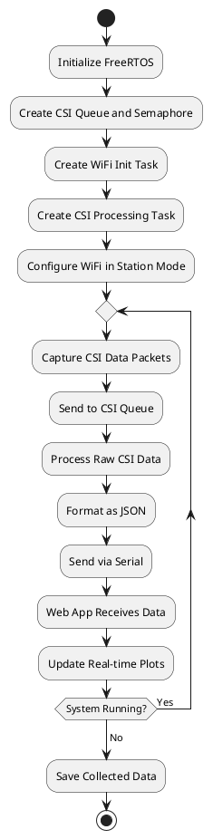

# ELE529E Embedded Systems Project Final Report

**Course:** ELE529E Embedded Systems  
**Submission Date:** 13/06/2025

## 1. Project Overview

| Project Title | CSI Data Collection Using ESP32 |
|---------------|---------------------|
| Team Members | Meliha Çağla Kara |
| Project Start Date | 18/04/2025 |
| Project Completion | 13/06/2025 |

## 2. Project Milestones & Delivery Plan

| Milestone | Tasks | Deadline | Status<br>(✓/✗) |
|-----------|-------|----------|-----------------|
| 1. Requirement Analysis | Define project scope, objectives, and CSI data collection requirements. | 02/05/2025 | ✓ |
| 2. System Design | ESP32 configuration, study Wi-Fi CSI architecture. | 16/05/2025 | ✓ |
| 3. Prototype Development | Implement ESP32 firmware for CSI data collection and Python visualization script. | 30/05/2025 | ✓ |
| 4. Testing & Debugging | Verify data accuracy, optimize capture rate, debug communication issues. | 05/06/2025 | ✓ |
| 5. Final Demo & Report | Prepare presentation with live visualization, data flow diagrams and submit final report. | 12/06/2025 | ✓ |

## 3. Individual Contribution Plan

### Meliha Çağla Kara

| Task | Responsibility | Estimated Time |
|------|---------------|----------------|
| ESP32 Configuration | Configure ESP32 for CSI data capture, Wi-Fi parameter setup. | 1.5 weeks |
| CSI Data Collection | Implement firmware for Channel State Information extraction. | 2 weeks |
| Data Transfer Protocol | Utilize an efficient format for transferring CSI data to computer. | 1.5 weeks |
| Python Visualization | Develop real-time visualization dashboard for CSI data. | 2 weeks |
| Testing & Validation | Verify accuracy across different environments, optimize performance. | 1 week |

## 4. Project Quality Utility Tree

**Objective:** Ensure reliable CSI data collection and meaningful visualization.

1. Functional Correctness  
   ├── 1.1 CSI Data Collection (successful capture of CSI values) ✓  
   ├── 1.2 Sampling Rate (minimum 10 samples/second) ✓  
   └── 1.3 Power Efficiency (doesn't heat in continuous operation) ✓  
2. Robustness  
   ├── 2.1 Error Handling (packet loss recovery, connection reestablishment) ✓  
   ├── 2.2 Fault Recovery (auto-restart on crash, data backup) ✓  
   └── 2.3 Real-time data logging (implemented with FreeRTOS queues) ✓  
3. Maintainability  
   ├── 3.1 Modular Code (separate modules for capture and visualization) ✓  
   └── 3.2 Documentation (code comments, setup guide, usage instructions) ✓  

## 5. Project Structure Diagram (PlantUML)

```plantuml
@startuml
package "Hardware" {
  [ESP32] --> [Wi-Fi Environment]
  [ESP32] --> [USB/Serial Connection]
}
package "Firmware" {
  [FreeRTOS Tasks] {
    [WiFi Init Task] as WIFI
    [CSI Processing Task] as CSI
  }
  [FreeRTOS Queues] {
    [CSI Data Queue] as QUEUE
  }
  [ESP32 Framework] --> [CSI Collection Module]
  [ESP32 Framework] --> [Data Processing Module]
  [ESP32 Framework] --> [Serial Communication Module]
}
package "Software" {
  [Python Web App] --> [Data Parsing]
  [Python Web App] --> [Real-time Visualization]
  [Python Web App] --> [Data Storage]
}
[ESP32] <--> [Python Web App] : Serial/USB Protocol
WIFI --> CSI : Semaphore
CSI --> QUEUE : Send
CSI <-- QUEUE : Receive
@enduml
```

## 6. Activity Diagram (PlantUML)



## 7. Project Demo Setup

### Hardware Requirements
- ESP32 Development Board
- USB-to-Serial Cable
- Computer for running web visualization
- Wi-Fi Access Point

### Software Requirements
- ESP-IDF Development Framework (v5.4)
- Python 3.x with Flask
- Web Browser

### Demo Steps
1. Power on the ESP32 and connect via USB
2. Launch the Python web application
3. Connect to ESP32 through the web interface
4. Start CSI data collection
5. Observe real-time CSI data visualization
6. Demonstrate subcarrier selection and plotting
7. Show data logging and export functionality

## 8. Risks & Mitigation

| Risk | Probability | Impact | Mitigation Strategy | Status |
|------|------------|--------|---------------------|--------|
| ESP32 CSI API Limitations | High | Medium | Used appropriate ESP-IDF version | ✓ |
| Serial Communication Bottlenecks | Medium | High | Implemented efficient JSON protocol | ✓ |
| Wi-Fi Interference | High | Medium | Basic error handling and reconnection | ✓ |
| Visualization Performance | Medium | Medium | Used efficient web-based rendering | ✓ |

## 9. Conclusion

The project successfully implemented a CSI data collection and visualization system using ESP32 and FreeRTOS:
- ✓ Implemented FreeRTOS tasks for WiFi initialization and CSI processing
- ✓ Developed efficient inter-task communication using queues
- ✓ Created a responsive web-based visualization interface
- ✓ Achieved reliable real-time data collection and display
- ✓ Met all project quality requirements

**Future Improvements:**
1. Add support for multiple ESP32 devices
2. Implement advanced CSI data analysis algorithms
3. Add machine learning capabilities for pattern recognition
4. Enhance visualization with 3D plots and matrix heatmaps

## Appendices
- [A] [GitHub Repository](https://github.com/chayoung0/CSI-Data-Collection-Using-ESP32)
- [B] [ESP32 CSI Functionality Documentation](https://docs.espressif.com/projects/esp-idf/en/latest/esp32/api-guides/wifi.html#wi-fi-channel-state-information)
- [C] Reference Papers on CSI-based Applications: [Awesome WiFi CSI Sensing](https://github.com/Marsrocky/Awesome-WiFi-CSI-Sensing)